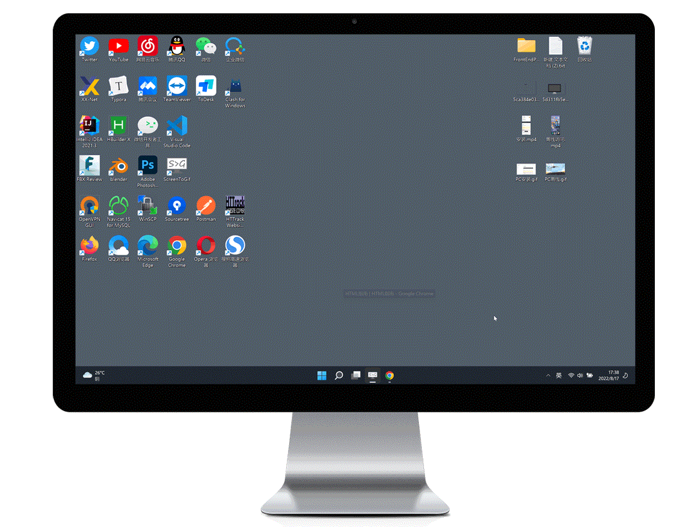
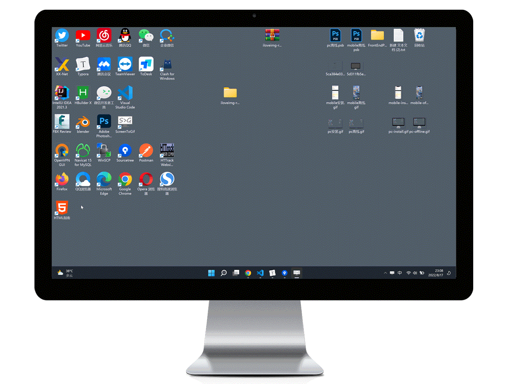

<p align="center"></p>

## 

<p align="center">
  <a href="https://github.com/JunLiangWangX/HTML-Guide" target="_blank">
    
  </a>
  <a href="https://github.com/JunLiangWangX/HTML-Guide/graphs/commit-activity"  target="_blank">
    
  </a>
  <a href="https://github.com/JunLiangWangX/HTML-Guide/commit"  target="_blank">
    
  </a>
  <a href="https://github.com/JunLiangWangX/HTML-Guide/issues?q=is%3Aopen"  target="_blank">
    
  </a>
  <a href="https://github.com/JunLiangWangX/HTML-Guide/issues?q=is%3Aclose"  target="_blank">
    
  </a>
  <a href="https://GitHub.com/JunLiangWangX/HTML-Guide/pull/"  target="_blank">
    
  </a>
  <a href="https://github.com/JunLiangWangX/HTML-Guide/pulls?q=is%3Aclosed"  target="_blank">
    
  </a>
</p>
<p align="center">
    <a href="https://wangjunliang.com/HTML-Guide/"></a>
    <a href="https://junliangwangx.github.io/HTML-Guide/en/"></a>
</p>
<p align='center'><a href='./README.md'>中文</a> &nbsp&nbsp&nbsp <a href='./README(EN).md'>English</a></p>

<p align='center'></p>

   

<details>
  <summary>目录</summary>
  <ul>
    <li><a href="#-项目背景">👀 项目背景</a></li>
    <li><a href="#-使用">🤳 使用</a></li>
    <li><a href="#-项目结构">🧩 项目结构</a></li>
    <li><a href="#-问题与评论">📫 问题与评论</a></li>
    <li><a href="#-贡献">👨‍💻 贡献</a></li>
    <li><a href="#-支持">💪 支持</a></li>
    <li><a href="#-license">🔑 License</a></li>
  </ul>
</details>

​	  

## 👀 项目背景

万丈高楼平地起，盘龙卧虎高山齐。前端技术日新月异，开发框架更是如雨后春笋般大量涌现。但无论技术如何发展，框架如何更新，万变不离其中，终究不过是HTML、JS、CSS的封装与变换。

<h5>我认为能否学好Web开发的关键在于是否学好与学懂HTML、JS、CSS三大基础语言。</h5>

本项目则是介绍三大基础语言之一HTML的网站（待本项目更新完成则会相继出CSS与JS的指南），目前市面上各类学习HTML网站如此之多，为什么还选择自己造轮子呢？原因在于我学习HTML时发现各类网站存在如下问题：

- 知识点较为分散，想要全面且统一的了解与学习HTML需要看很多不同的网站
- 各种网站的操作又较为复杂，各种跳转与广告让人思绪混乱
- 知识点介绍生硬，让人难以理解

<h5>因此我就萌生了要自己做一个介绍HTML的网站，它能全面且统一、生动且形象的介绍HTML，它不会广告满天飞，布局结构干净整洁，能够快速且准确给您想要的答案！于是乎该项目——《HTML指南》便诞生了！</h5>

​    

## 🤳 使用

<p align='center'>为给大家带来不一样的感受，我们使用了一些技术手段以及满足了PWA的所有特性，它会给您带来意想不到的体验！！！</p>

<h3 align='center'>😀🤩😍🥳</h3>

​     

<h3 align='center'>⚙️ 可安装 ⚙️</h3>

<h5 align='center'>PC可通过浏览器导航栏右上角安装图标将网页安装到桌面，移动设备可通过浏览器将网页添加到主屏幕，这样您就可获得应用级的体验</h5>




​     

<h3 align='center'>❌ 可离线访问 ❌</h3>

<h5 align='center'>当您将网页添加到桌面，您就可获得应用级的体验，这包括了即使在没有网络的情况下，您依然可以正常访问网页阅读文档</h5>


​    

<h3 align='center'>📍 记录阅读位置 📍</h3>

<h5 align='center'>当您退出网页再次进入时，点击'返回之前位置'即可回到上次阅读的位置</h5>



   

## 🧩 项目结构

```
├── .github/workflows                     # github action 配置文件存放目录
|    ├── deploy.yml                       # github pages 自动部署
|    └── generate-readme-file.yml         # readme相关资源文件自动生成
├── docs                                  # 网站内容存放目录
|    ├── .vuepress                        # 用于存放vuepress全局的配置、组件、静态资源等
|    |    ├── public                      # 静态资源存放目录
|    |    |    ├── manifest.json          # PWA manifest配置文件
|    |    |    └── ......                 # png/svg...等资源文件
|    |    ├── styles                      # 样式文件存放目录
|    |    |    └── palette.styl           # 用于重写默认颜色常量
|    |    ├── config.js                   # 配置文件的入口文件
|    |    └── enhanceApp.js               # 客户端应用的增强配置
|    ├── en                               # 用于存放英文页面
|    |    ├── comment.md                  # 评论页面(英文)
|    |    ├── usage.md                    # 使用说明页面(英文)
|    |    └── xxx.md                      # md结尾的都是各类页面(英文)
|    ├── comment.md                       # 评论页面(中文)
|    ├── usage.md                         # 使用说明页面(中文)
|    └── xxx.md                           # md结尾的都是各类页面(中文)
├── resource                              # 存放readme中的静态资源
|    └── ......                   
├── .gitignore                            # github忽略文件
├── LICENSE                               # license
├── README(EN).md                         # readme英文
├── README.md                             # readme
├── _config.yml                           # github page配置页面
└── package.json                          # npm配置文件
```

   

## 📫 问题与评论


#### 遇到问题怎么办？

如果您在使用中遇到问题，请您先搜索[issues](https://github.com/JunLiangWangX/HTML-Guide/issues)中是否有您的问题的答案，如果未能找到答案，请您在[issues](https://github.com/JunLiangWangX/HTML-Guide/issues)中提交您遇到的问题，我们会及时处理。

#### 怎么发表您的看法与建议？

如果您想发表自己的看法与建议，您可以前往[discussions](https://github.com/JunLiangWangX/HTML-Guide/discussions)或者[issues中的评论](https://github.com/JunLiangWangX/HTML-Guide/issues/3)中发表，当然您也可以直接前往[站点的评论区](https://junliangwangx.github.io/HTML-Guide/en/comment.html)([国内](https://wangjunliang.com/HTML-Guide/comment.html))发表

   

## 👨‍💻 贡献

如果您发现了项目bug或者有兴趣为该项目做出贡献，请您遵循以下规则：

- 本项目由[vuepress](https://vuepress.vuejs.org/)构造，需要您具备基于[vuepress](https://vuepress.vuejs.org/)的开发能力
- 仔细阅读[🧩项目结构](#-项目结构)以及相关的项目代码，确保您已足够了解项目
- 如果是项目bug请提交一个[issue](https://github.com/JunLiangWangX/HTML-Guide/issues)，在提交 issue 之前，请搜索相关内容是否已被提出
- 请先 fork 一份到自己的项目下，不要直接在仓库下建分支。
- commit 信息请描写准确
- 确保 PR 是提交到 `dev` 分支，而不是 `main` 分支

<h4>海内存知己，天涯若比邻。感谢大家的贡献!!!</h4>


   

## 💪 支持

<p align='center'>
    <h4 align='center'>赠汪伦</h4>
    <p align='center'>李白</p>
    <p align='center'>李白乘舟将欲行，忽闻岸上踏歌声。</p>
    <p align='center'>桃花潭水深千尺，不及汪伦送我情。</p>
</p>


<p align='center'>
   如若您觉得项目不错可以给项目一个<a href='https://github.com/JunLiangWangX/HTML-Guide/'>start</a>✨,并在<a href='https://github.com/JunLiangWangX/HTML-Guide/issues/3'>评论</a>中发表您的想法✍。当然您如果比较宽裕的话，可以请作者喝一杯咖啡🍵
</p>

|                    支付宝                     |                       微信                       |
| :-------------------------------------------: | :----------------------------------------------: |
|  |  |

  

## 🔑 License

[MIT](./LICENSE)	